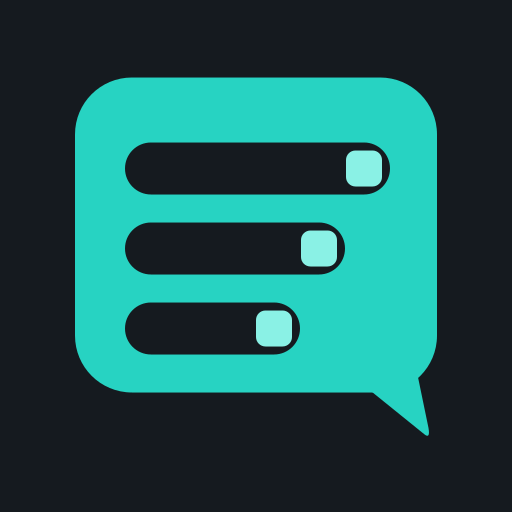

# Tokenlogue

[English](#lang-en) | [Русский](#lang-ru)

## English

Tokenlogue is a desktop application for chatting with AI models through
OpenRouter. It saves conversations and unsent drafts on your device and lets
you set token and spending limits for each chat. The application interface
is currently in Russian.

### Download and launch

The current [published Linux preview](https://github.com/Umichata/tokenlogue/releases/tag/v0.1.0-linux-preview.2b1f7d3)
is `0.1.0` from commit `2b1f7d3`. It provides the
[AppImage](https://github.com/Umichata/tokenlogue/releases/download/v0.1.0-linux-preview.2b1f7d3/Tokenlogue-0.1.0-2b1f7d3-x86_64.AppImage)
and the [SHA256SUMS checksum file](https://github.com/Umichata/tokenlogue/releases/download/v0.1.0-linux-preview.2b1f7d3/SHA256SUMS).
No GitHub sign-in is needed. Follow the [Linux guide](docs/linux-appimage.md#lang-en)
to download all six preview files, check SHA256SUMS and run the application.

| File | SHA-256 |
| --- | --- |
| `Tokenlogue-0.1.0-2b1f7d3-x86_64.AppImage` | `0852f9432cb089e31fef2722d84ce7124714588afb65d6f25cd64d0616a4779d` |

You need an x86-64-v2 compatible processor, system GTK3, graphics drivers
and a working Secret Service for storing the API key. You do not need to install Python, uv or Flutter SDK separately.

This preview is unsigned and does not update automatically.
Ready-to-use Windows, Android, DEB
and RPM packages are not available.

### How to use Tokenlogue

1. Enter your OpenRouter API key. After the key is checked, save the generated
   four-digit PIN. You will use it to unlock the application on later launches.
2. Create a chat with `+`. Choose a free or paid mode and a model, then set
   the chat's token limit. For a paid chat, also set a spending limit.
3. Type a message and send it. Tokenlogue asks for confirmation before each
   paid request and before increasing a chat's spending limit.

Conversation history and a separate draft for each chat are saved
automatically. You can switch chats or restart the application and continue
where you left off.

Open `⋮` at the far right of the header to view the key status, chat mode,
model, token usage and spending. The same menu lets you change limits,
rename a chat or delete it. The `+` and lock buttons remain beside the menu.
In a narrow window, the button at the top left opens the chat list.

The [user guide](docs/user-guide.md#lang-en) covers setup, keyboard controls,
drafts, budget reservations and what to do if a request's result is unknown.

### Where your data is stored

History and drafts are stored in a local SQLite database without additional
content encryption. The PIN controls access through the application interface
and is not stored as plain text. The API key is kept separately in the
platform's SecureStorage. Protect your operating-system account and backups.

When you send a message, its text and conversation context go to OpenRouter
and the selected model provider. Unsent drafts stay on your device and do not
consume tokens or money. You need an OpenRouter account and an internet
connection to use the service. OpenRouter has its own usage and data terms.
Tokenlogue is an independent application and is not affiliated with OpenRouter.
See [data storage and reset](docs/user-guide.md#en-data) for details.

### Source code and licenses

Tokenlogue's own code is available under the [MIT License](LICENSE).
The [third-party software overview](THIRD_PARTY_NOTICES.md#lang-en) lists the
main dependencies and explains where to find their licenses in the AppImage.

The [source materials guide](docs/source-materials.md#lang-en) links to the
application source, the published baseline from preview `986c6ad` and its
separate runtime bundle. Use that baseline together with
`Tokenlogue-2b1f7d3-source-supplement.tar.gz` for the current preview.
The [published source-material instructions](https://github.com/Umichata/tokenlogue/releases/download/v0.1.0-linux-preview.2b1f7d3/SOURCE_MATERIALS.md#lang-en)
explain how to download, restore and select the collected files. Completeness
of the full source set and a full offline rebuild remain unverified.
The source review status remains `REVIEW_REQUIRED`.

## Русский

Tokenlogue - настольное приложение для общения с моделями ИИ через OpenRouter.
Оно сохраняет переписку и неотправленные черновики на вашем устройстве
и позволяет задавать лимиты токенов и расходов для каждого чата.
Интерфейс приложения сейчас на русском языке.

### Скачивание и запуск

Текущая [опубликованная предварительная версия для Linux](https://github.com/Umichata/tokenlogue/releases/tag/v0.1.0-linux-preview.2b1f7d3)
имеет номер `0.1.0` и собрана из коммита `2b1f7d3`. Для неё доступны
[AppImage](https://github.com/Umichata/tokenlogue/releases/download/v0.1.0-linux-preview.2b1f7d3/Tokenlogue-0.1.0-2b1f7d3-x86_64.AppImage)
и [файл контрольных сумм SHA256SUMS](https://github.com/Umichata/tokenlogue/releases/download/v0.1.0-linux-preview.2b1f7d3/SHA256SUMS).
Вход в GitHub не нужен. Следуйте [руководству для Linux](docs/linux-appimage.md#lang-ru),
чтобы скачать все шесть файлов предварительной версии, проверить SHA256SUMS
и запустить приложение.

| Файл | SHA-256 |
| --- | --- |
| `Tokenlogue-0.1.0-2b1f7d3-x86_64.AppImage` | `0852f9432cb089e31fef2722d84ce7124714588afb65d6f25cd64d0616a4779d` |

Нужны процессор с поддержкой x86-64-v2, системная GTK3, видеодрайверы
и работающий Secret Service для хранения API-ключа. Отдельно устанавливать Python, uv или Flutter SDK не нужно.

У этой предварительной сборки нет цифровой подписи и автоматического обновления.
Готовых пакетов
для Windows и Android, а также пакетов DEB и RPM пока нет.

### Как пользоваться Tokenlogue

1. Введите API-ключ OpenRouter. После проверки ключа сохраните созданный
   четырёхзначный PIN. Он понадобится для входа при следующих запусках.
2. Создайте чат кнопкой `+`. Выберите бесплатный или платный режим и модель,
   затем задайте лимит токенов. Для платного чата также укажите лимит расходов.
3. Напишите и отправьте сообщение. Перед каждым платным запросом
   и увеличением денежного лимита чата приложение запросит подтверждение.

История переписки и отдельный черновик каждого чата сохраняются автоматически.
Можно переключиться в другой чат или перезапустить приложение, а затем
продолжить с того же места.

Откройте `⋮` в правом краю шапки, чтобы посмотреть состояние ключа, режим чата,
выбранную модель, расход токенов и денег. В этом же меню можно изменить лимиты,
переименовать или удалить чат. Кнопки `+` и блокировки находятся рядом с меню.
В узком окне кнопка слева вверху открывает список чатов.

[Руководство пользователя](docs/user-guide.md#lang-ru) объясняет настройку,
управление с клавиатуры, сохранение черновиков, резервирование бюджета
и действия при неизвестном результате запроса.

### Где хранятся ваши данные

История и черновики находятся в локальной базе SQLite без дополнительного
шифрования содержимого. PIN ограничивает доступ через интерфейс приложения
и не хранится открытым текстом. API-ключ сохраняется отдельно
в платформенном хранилище SecureStorage. Защищайте свою учётную запись ОС
и резервные копии.

При отправке сообщения его текст и контекст переписки передаются в OpenRouter
и выбранному поставщику модели. Неотправленные черновики остаются на устройстве
и не расходуют токены или деньги. Для работы сервиса нужны учётная запись
OpenRouter и подключение к интернету. У OpenRouter действуют собственные
условия использования и обработки данных. Tokenlogue разрабатывается независимо
от OpenRouter. Подробнее в разделе
[о хранении данных и сбросе доступа](docs/user-guide.md#ru-data).

### Исходный код и лицензии

Собственный код Tokenlogue доступен по [лицензии MIT](LICENSE).
[Обзор сторонних компонентов](THIRD_PARTY_NOTICES.md#lang-ru) перечисляет
основные зависимости и объясняет, где найти их лицензии внутри AppImage.

[Руководство по исходным материалам](docs/source-materials.md#lang-ru)
содержит ссылки на код приложения, опубликованный базовый комплект версии
`986c6ad` и его отдельный комплект runtime. Для текущей предварительной версии
используйте этот базовый комплект вместе с
`Tokenlogue-2b1f7d3-source-supplement.tar.gz`.
[Инструкция к опубликованным исходным материалам](https://github.com/Umichata/tokenlogue/releases/download/v0.1.0-linux-preview.2b1f7d3/SOURCE_MATERIALS.md#lang-ru)
объясняет, как скачать, восстановить и выбрать собранные файлы. Полнота всего
исходного набора и полная пересборка без сети остаются непроверенными.
Статус проверки исходных материалов остаётся `REVIEW_REQUIRED`.
