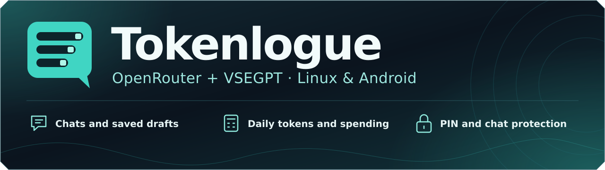
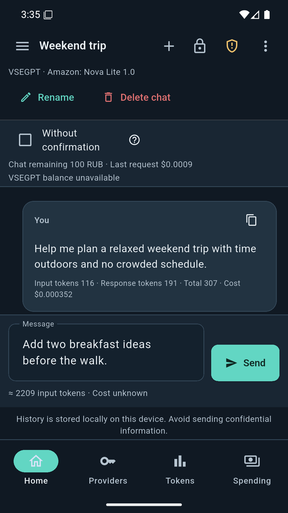

 
   

<h1 align="center"></h1>

     

<h3><strong>OpenRouter and VSEGPT chats for Linux and Android.</strong> Keep conversations and drafts together, choose a model for each chat and review tokens and spending.</h3>

> **[0.1.1 Preview](https://github.com/Umichata/tokenlogue/releases/tag/v0.1.1-preview.1)** provides the Python Android ARM64 APK (build 56) and a Linux x86_64 desktop bundle. Read the platform requirements and verify the downloaded file before installing.

##  What you can do

- Keep OpenRouter and VSEGPT keys separately in protected storage.
- Review the provider and masked shared key in **⋮**, then [change that chat’s provider explicitly](docs/user-guide.md#en-chat-connection).
- View daily tokens with separate API usage and local estimates, and choose a service for each new chat.
- Use **Home**, **Providers**, **Tokens** and **Spending** without losing the current chat or draft.
- Use the **Provider** dropdown to view **All**, **OpenRouter** or **VSEGPT**. The viewing filter does not change the provider of a chat.
- Track local token usage and daily costs by provider and model. USD and RUB remain separate.
- Review approximate costs and chat-budget warnings before sending a paid request.
- Use English or Russian, app PIN access and encryption of saved conversation fields.

##  Interface

| Linux | Android emulator |
| --- | --- |
| <a href="docs/assets/screenshots/v011-55-linux-home-en.png">  </a> | <a href="docs/assets/screenshots/v011-55-android-home-en.png">  </a> |

*Demonstration data. Android images show an emulator.* [Tablet view](docs/assets/screenshots/v011-55-android-chat-after-change-en.png).

##  Install and update

| Platform | Package | Installation |
| --- | --- | --- |
| Android ARM64 · Python | 0.1.1 APK, versionCode 56, API 24 or later |   |
| Android ARM64 · Dart | 0.1.1+18, API 24 or later, separate profile | [Installation and updates](https://github.com/Umichata/tokenlogue/blob/android-dart/README.md) |
| Linux x86_64 | 0.1.1+56 desktop bundle |   |

Choose your platform's package on the release page and check its checksum using the platform guide. Linux is supplied as a complete bundle, rather than an AppImage. The archive is unsigned. You do not need Python, Flutter or source archives to run the packaged app.

Install a compatible Android update over the existing app with the same signature. Keep its data. On Linux, close old copies before starting a replacement under the same OS account.

### First connection

1. Enter a supported provider key and choose **Check key**. VSEGPT can be saved explicitly as unverified when a free check is unavailable.
2. Choose and repeat an app PIN. Save the recovery material offered for your platform.
3. Create a chat with **+**, choose its model and limits, then write a message.

See [chat instructions](docs/user-guide.md), [provider settings](docs/providers.md) and [token and spending statistics](docs/analytics.md).

##  Know what the numbers mean

A service balance, the remaining OpenRouter key limit and a chat budget are different values. VSEGPT has no supported separate key-limit indicator. Unknown amounts stay unavailable. Local token and cost estimates are approximate.

PIN access and encryption protect selected local fields. They do not encrypt the entire device. Sending shares the necessary conversation content with the service assigned to that chat and its model provider. [Protection and recovery](docs/security.md) explains the requirements and the consequences of deleting a profile.

##  Documentation

<table>
<tr><th align="left">Section</th><th align="left">Documents</th></tr>
<tr><td><strong>Install</strong></td><td> </td></tr>
<tr><td><strong>Providers and chats</strong></td><td> </td></tr>
<tr><td><strong>Tokens and spending</strong></td><td></td></tr>
<tr><td><strong>Protection and recovery</strong></td><td></td></tr>
<tr><td><strong>Sources and licences</strong></td><td>  </td></tr>
<tr><td><strong>Versions</strong></td><td></td></tr>
</table>

##  Sources and licenses

Tokenlogue uses the [MIT license](LICENSE). [Source materials](docs/source-materials.md) and [third-party notices](THIRD_PARTY_NOTICES.md) describe the supplied components and the remaining limits of binary provenance. See [0.1.1 release notes](CHANGELOG.md).
